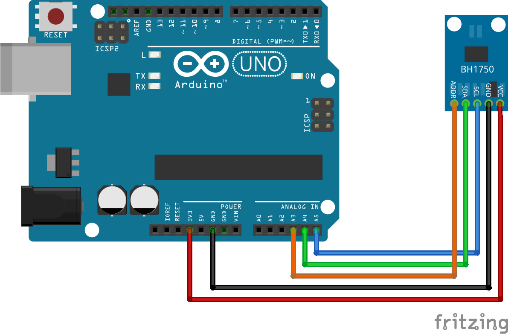

# Sensor de Luminosidad

## Resumen

Con objeto de determinar el índice de luminosidad que está recibiendo el satélite en cada una de sus caras, se requiere la implementación de un conjunto de sensores que, mediante el empleo de una comunicación serial a través del bus I2C, nos permita obtener dicha información.

## Autoría y Licencia

- Autor: **Dailos Rafael Díaz Lara** ( ddialar@gmail.com )
- Fecha: **11/10/2015**
- Versión: **1.0.0**
- Licencia: [](http://creativecommons.org/licenses/by-nc-sa/4.0/)

## Componentes

[BH1750FVI Datasheet](https://drive.google.com/file/d/0B9MFbIOjcsx4ZEM1M1FrOTVyaTA/view?usp=sharing)

## Artículos de referencia

[instructables.com - BH1750 Digital Light Sensor by Mohannad Rawashdeh](http://www.instructables.com/id/BH1750-Digital-Light-Sensor/?ALLSTEPS)

## Procedimiento

El sensor de luminosidad basado en el componente **BH1750** posee una sensibilidad ajustable según los siguientes niveles: 0,5 lx, 1,0 lx y 4,0 lx.

Dependiendo de la resolución de lectura que configuremos, el tiempo entre lecturas va desde los 120 ms para las resoluciones de 0,5 y 1,0 lx, hasta los 16 ms para la resolución de 4 lx.

Independientemente de los niveles de sensibilidad con el que configuremos nuestro sensor, el rango de resolución que tiene es desde **0 lx** hasta los **65535 lx**.

Para comunicarse con el microcontralador que utilicemos a la hora de trabajar con el sensor, éste emplea el bus de comunicaciones I2C.

Una de las principales características que identifican a este bus de comunicaciones, es que permite la conexión de múltiples sensores a dicho bus. Para poder llevar a cabo esta operación, se emplea una dirección específica que identifica inequívocamente a cada sensor.

Uno de los principales inconvenientes que presenta este sensor es que **no permite la configuración personalizada de la dirección** a asignar al sensor en el bus de comunicaciones.

En su defecto, este sensor tiene definidas por firmware dos direcciones posibles: 0x23 y 0x5C.

Para poder indicar en qué dirección se encuentra el sensor, éste cuenta con un pin denominado ```ADDR``` mediante el cual, si lo ponemos a tierra (ADDR <= 0,3V) estaremos seleccionando la dirección 0x23 mientras que su ponemos el pin a alimentación (ADDR >= 0,7V) estaremos configurando el sensor con la dirección 0x5C.

Una vez hecho esto, el montaje a implementar es el siguiente:



Como se puede apreciar en el diagrama anterior, este sensor se alimenta a **3,3 VDC** de manera que si lo alimentamos con los 5 VDC proporcionados por Arduino, lo más probable es que estropeemos el sensor.

Una vez tenida en cuenta esta advertencia y después de haber realizado el montaje indicado, mediante el uso del código de ejemplo incluído en la carpeta [arduino](arduino/sensor_de_luz_test/), al arranzar la monitor serial, podremos ver cómo recibimos los datos del sensor.
